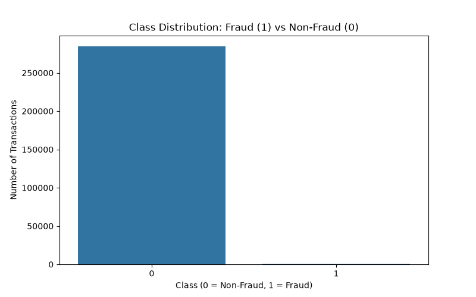
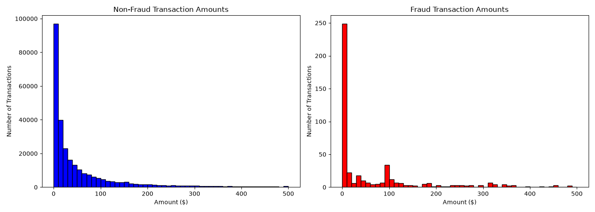
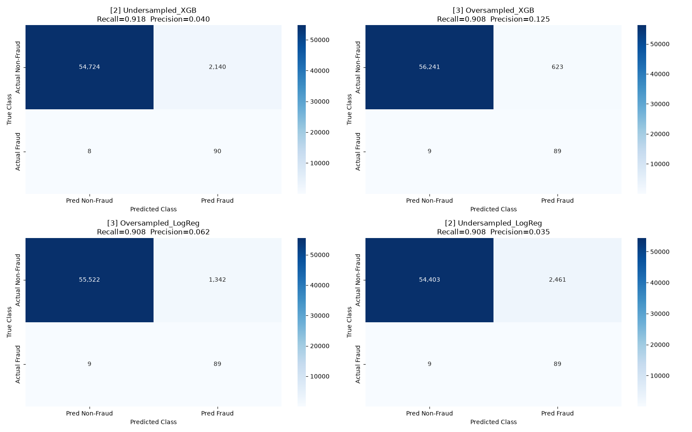

# Credit Card Fraud Detection

This project compares supervised classification and unsupervised anomaly detection on a highly imbalanced credit-card transaction dataset. It focuses on catching fraud while accounting for the different business costs of missed fraud and false alarms.

## What the project covers

- Exploratory data analysis and class-imbalance checks
- Leakage-safe training, validation, and test splits
- Feature scaling fitted on training data only
- Random undersampling, random oversampling, and SMOTE
- Logistic Regression, Random Forest, and XGBoost
- Isolation Forest without fraud labels
- Validation-based probability-threshold selection
- Accuracy, precision, recall, F1, ROC-AUC, and PR-AUC
- False-negative and false-positive cost comparison
- Confusion-matrix and feature-importance visualizations

## Latest results

The latest reproducible run evaluated 13 models on an untouched test set containing 56,962 transactions and 98 fraud cases.

| Result | Model | Value |
|---|---|---:|
| Highest recall | Undersampled XGBoost | 91.8% |
| Lowest estimated test cost | Oversampled Random Forest | $1,245 |
| Best original-data F1 | Original XGBoost | 0.7962 |
| Isolation Forest recall | Isolation Forest | 28.6% |

The highest-recall model caught 90 of 98 fraud cases, but it also created 2,140 false alarms. The lowest-cost model provided a better balance under the assumed cost of $100 per missed fraud and $1 per false alarm. This illustrates why fraud models should be selected using business costs as well as recall.

## Visualizations







## Dataset

Download the Kaggle **Credit Card Fraud Detection** dataset and place `creditcard.csv` beside `fraud_detection.py`.

The CSV is intentionally excluded from this repository because it is large and should be obtained from its original source.

## Setup

Create a virtual environment and install the dependencies:

```powershell
python -m venv .venv
.\.venv\Scripts\python.exe -m pip install -r requirements.txt
```

Run the project:

```powershell
.\.venv\Scripts\python.exe fraud_detection.py
```

The script prints the model-comparison table and saves three PNG visualizations in the project directory.

## Project structure

```text
credit-card-fraud-detection/
|-- fraud_detection.py
|-- requirements.txt
|-- README.md
|-- class_distribution.png
|-- amount_histograms.png
|-- confusion_matrices.png
`-- .gitignore
```

## Limitations

The `V1` through `V28` fields are PCA-transformed features, so their business meaning is unavailable. The cost values are based on illustrative assumptions and should be replaced with real operational estimates before deployment. Model performance may also change as fraud behavior changes over time.
